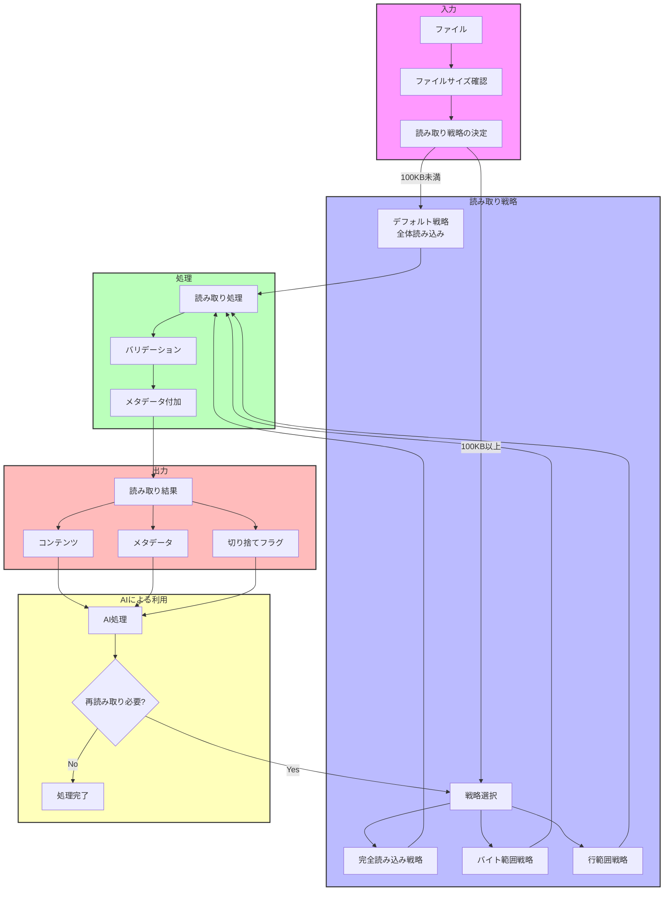

# read_file ツール拡張設計資料

## 1. 概要

### 現状
現在の`read_file`機能は、ファイルを読み込む際に以下の動作をします：
- 通常サイズのファイル（100KB未満）: 全体を読み込む
- 大きなファイル（100KB以上）: 先頭の100KBのみを読み込み、`isTruncated: true`フラグを設定
- PDF、DOCX、IPYNBなどの特殊ファイル: 専用の抽出ロジックを使用

### 課題
大きなファイル（100KB以上）を読み込んだ場合：
1. 先頭100KBのみが返され、残りの部分にアクセスできない
2. ユーザーやAIが残りの部分を読みたい場合や特定部分だけを読みたい場合、それを指定するフローが存在しない
3. `isTruncated: true`フラグは設定されるが、それに基づいて再度読み取りを行う機能がない

### 改善目的
1. 大きなファイルを効率的に扱うための複数の読み取り戦略を提供
2. AIが必要な情報を選択的に取得できるようにする
3. コンテキストウィンドウの効率的な利用を実現

## 2. 要件

### 機能要件
1. 読み取り戦略を指定するパラメータの追加
   - 全体読み込み: 大きなファイルでも全体を読み込む
   - バイト範囲指定: 特定のバイト範囲を指定して読み込む
   - 行範囲指定: 特定の行範囲を指定して読み込む
   - セマンティック分割: 内容に基づいて重要部分を抽出（将来の拡張）

2. エラーハンドリングの改善
   - より詳細なエラー情報の提供
   - ファイルアクセス権限エラーの適切な処理
   - 不正なパラメータのバリデーション

3. 読み取り結果の拡張
   - ファイル情報の充実（最終更新日時、所有者など）
   - 読み取り戦略に関する情報の追加
   - ファイルタイプごとの追加メタデータ

## 3. 設計詳細

### インターフェース変更

```typescript
// 読み取り戦略の定義
type ReadingStrategy =
  | { type: 'default' }  // デフォルト戦略（閾値に基づく読み取り）
  | { type: 'complete' } // 全体読み込み
  | { type: 'byteRange', start: number, end?: number } // バイト範囲指定
  | { type: 'lineRange', startLine: number, endLine?: number } // 行範囲指定

// 関数シグネチャの拡張
interface ExtractTextOptions {
  strategy?: ReadingStrategy;
  includeMetadata?: boolean; // 追加のメタデータを含めるか
}

// 返り値の拡張
interface ReadResult {
  content: string;
  fileInfo?: FileInfo;
  isTruncated: boolean;
  appliedStrategy: ReadingStrategy; // 適用された戦略
  remainingSize?: number; // 残りのファイルサイズ（切り捨て時）
  metadata?: Record<string, any>; // 追加のメタデータ
}

async function extractTextFromFile(
  filePath: string,
  options?: ExtractTextOptions
): Promise<ReadResult>
```

### データフロー図



### 実装フロー

1. ファイルの基本情報取得（サイズ、タイプ）
2. 指定された戦略に基づいて読み取り方法を決定
   - デフォルト戦略: 現行の閾値ベースロジック
   - 完全読み込み: ファイルサイズに関わらず全体を読み込む
   - バイト範囲: 指定された範囲のみを読み込む
   - 行範囲: ファイルを行単位で読み込み、指定範囲を抽出
3. ファイルタイプごとの専用処理（PDF、DOCX等）
4. 結果オブジェクトの構築と返却

### エラー処理フロー

1. パラメータバリデーション
   - 存在しないファイルパス
   - 無効な範囲指定（負の値、範囲外）
   - 未サポートのファイルタイプ
2. ファイルアクセスエラー処理
   - 権限エラー
   - ロックエラー
   - I/Oエラー
3. 適切なエラーメッセージとエラーコードの設定

## 4. 実装計画

### フェーズ1: 基本機能実装
1. `ReadingStrategy`型と`ExtractTextOptions`インターフェースの実装
2. `extractTextFromFile`関数の拡張
3. デフォルト戦略と完全読み込み戦略の実装
4. 基本的なテストケースの追加

### フェーズ2: 高度な戦略実装
1. バイト範囲読み取り戦略の実装
2. 行範囲読み取り戦略の実装
3. 追加のテストケースと統合テスト
4. エラー処理の強化

### フェーズ3: メタデータと最適化
1. 追加メタデータの実装
2. パフォーマンス最適化
3. ドキュメント更新
4. コードレビューと最終調整

## 5. テスト戦略

### ユニットテスト
1. 各読み取り戦略の正常ケース
   - 小さなファイルでの各戦略の動作
   - 大きなファイルでの各戦略の動作
   - 特殊ファイル（PDF、DOCXなど）での各戦略の動作

2. エラーケース
   - 存在しないファイルパス
   - 無効なパラメータ
   - アクセス権限エラー
   - 不正なファイルタイプ

### 統合テスト
1. Clineクラスとの統合
2. UIコンポーネントとの連携
3. エンドツーエンドのユーザーフロー

### パフォーマンステスト
1. 大きなファイルでの各戦略のパフォーマンス測定
2. メモリ使用量の監視
3. 応答時間の測定

## 6. 将来の拡張性

1. AIベースのコンテンツ分析と自動要約
2. ファイル差分検出と変更追跡
3. プログラミング言語対応の拡張（AST解析など）
4. マルチメディアファイルのテキスト抽出機能強化

## 7. リスクと緩和策

1. **リスク**: 巨大ファイルによるメモリ消費
   **緩和策**: ストリーミング処理の導入、チャンク単位での読み込み

2. **リスク**: 複雑なファイル形式の処理エラー
   **緩和策**: 堅牢なエラーハンドリング、フォールバックメカニズム

3. **リスク**: パフォーマンス低下
   **緩和策**: キャッシング、非同期処理、処理の最適化
